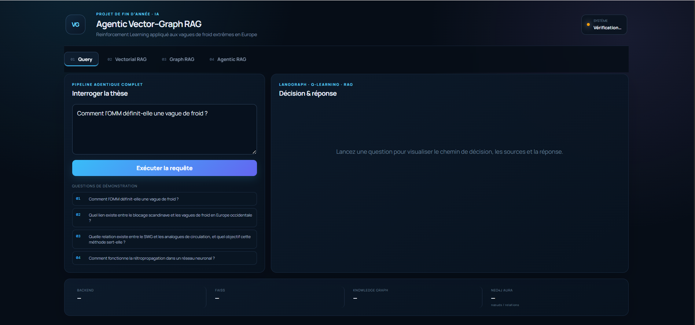
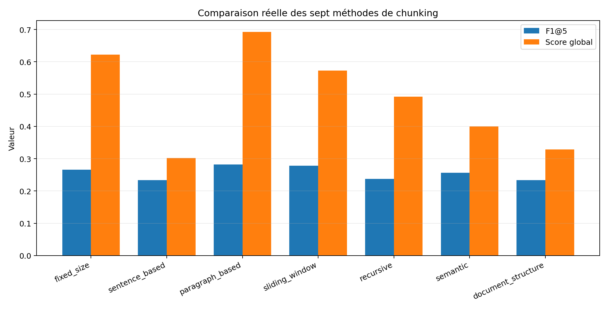
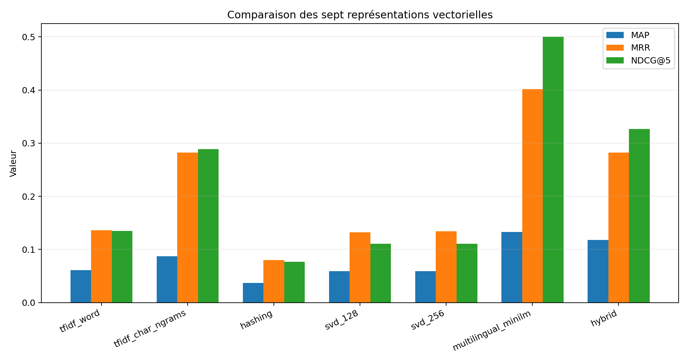
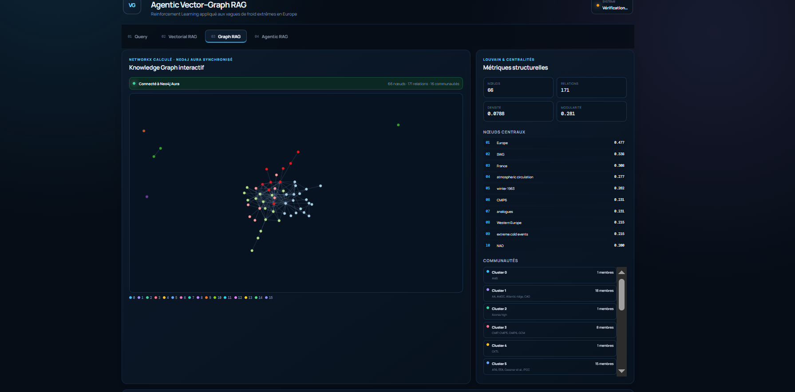
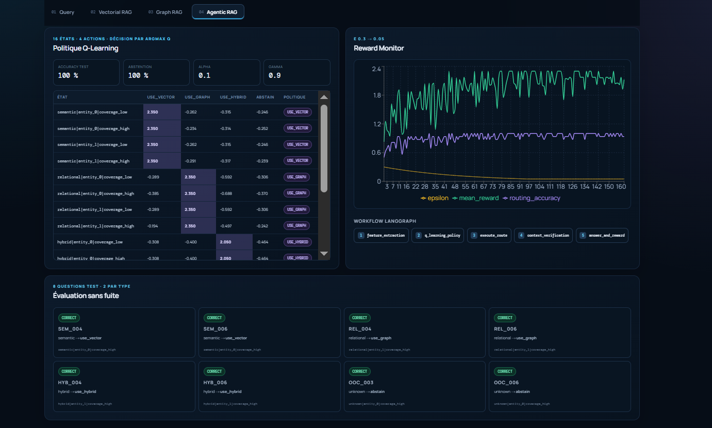
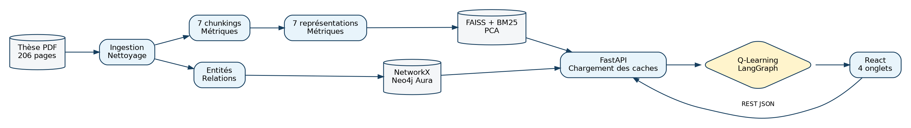

# Agentic Vectorial Graph RAG avec apprentissage par renforcement

> Un assistant documentaire spécialisé qui répond à des questions sur une thèse scientifique de 206 pages — et qui **décide lui-même** s'il doit répondre depuis un index vectoriel, un graphe de connaissances, les deux, ou dire « Je ne sais pas ».

[](https://www.python.org/)
[](https://fastapi.tiangolo.com/)
[](https://react.dev/)
[](https://neo4j.com/)
[](https://faiss.ai/)
[](https://langchain-ai.github.io/langgraph/)
[](LICENSE)

🇬🇧 [Read this document in English](README.md)

---

## De quoi il s'agit

Projet de fin d'année — 4ème année, spécialité Intelligence Artificielle. Le corpus est un document unique : *Une approche statistique pour l'étude de l'intensité et de la dynamique des vagues de froid extrêmes en Europe*, thèse de doctorat de Camille Cadiou (Université Paris-Saclay / LSCE, 2025, 206 pages).

**Ce n'est pas un modèle de prévision météorologique.** C'est un système de recherche documentaire construit pour démontrer et arbitrer trois paradigmes RAG sur un même corpus :

| Paradigme | Ce qu'il fait ici |
|---|---|
| **Vectorial RAG** | 7 méthodes de chunking et 7 représentations vectorielles réellement comparées, puis FAISS + BM25 + fusion RRF |
| **Graph RAG** | Entités et relations scientifiques extraites en graphe de connaissances, persistées dans Neo4j Aura, analysées avec NetworkX + Louvain |
| **Agentic RAG + RL** | Un agent Q-Learning orchestré par LangGraph route chaque question vers le bon store — ou s'abstient |

La règle qui traverse tout le projet : **aucune métrique inventée, aucune valeur codée en dur.** Tous les chiffres ci-dessous proviennent d'une exécution réelle sur la thèse.

<p align="center">
  
</p>

---

## Résultats

Le système ingère les 206 pages sans OCR et en conserve 132. Le reste — articles de revue insérés, annexe B, pages liminaires — est exclu volontairement et réutilisé comme source de questions hors contexte.

| Ingestion | Valeur |
|---|---|
| Pages PDF / retenues / exclues | 206 / 132 / 74 |
| Caractères et mots utiles | 289 941 et 45 769 |
| Acronymes extraits | 25 |
| Réparations de frontières de page | 7 |
| OCR nécessaire | Non |

### Chunking — 7 méthodes comparées

`paragraph_based` l'emporte au score global et devient la méthode de production, ce qui est cohérent avec un corpus rédigé en paragraphes argumentatifs.

| Méthode | Chunks | F1@5 | Recall@5 | Intra | Score global |
|---|---|---|---|---|---|
| fixed_size | 416 | 0,266 | 0,528 | 0,417 | 0,622 |
| sentence_based | 413 | 0,234 | 0,472 | 0,394 | 0,302 |
| **paragraph_based** | **680** | **0,282** | 0,556 | 0,393 | **0,693** |
| sliding_window | 478 | 0,278 | 0,528 | 0,384 | 0,573 |
| recursive | 504 | 0,237 | 0,500 | **0,429** | 0,492 |
| semantic | 456 | 0,256 | 0,556 | 0,396 | 0,400 |
| document_structure | 299 | 0,234 | **0,611** | 0,411 | 0,329 |

`document_structure` obtient le meilleur Recall@5, mais son score global est pénalisé par les autres critères.

### Embeddings — 7 représentations comparées

Le vrai enjeu est le **retrieval cross-lingue** : les questions sont posées en français, le manuscrit est à ~90 % en anglais. C'est ce qui disqualifie les méthodes lexicales comme modèle principal.

| Représentation | Dim. | F1@5 | MAP | MRR | NDCG@5 | Temps (s) |
|---|---|---|---|---|---|---|
| tfidf_word | 7 901 | 0,051 | 0,061 | 0,136 | 0,135 | 0,12 |
| tfidf_char_ngrams | 22 176 | 0,126 | 0,087 | 0,282 | 0,289 | 0,34 |
| hashing_vectorizer | 8 192 | 0,032 | 0,037 | 0,080 | 0,077 | 0,05 |
| tfidf_svd_128 | 128 | 0,037 | 0,059 | 0,132 | 0,111 | 0,43 |
| tfidf_svd_256 | 256 | 0,037 | 0,059 | 0,134 | 0,111 | 0,91 |
| **multilingual_minilm** | **384** | **0,282** | **0,133** | **0,402** | **0,500** | 24,21 |
| hybrid_tfidf_minilm | 512 | 0,159 | 0,118 | 0,282 | 0,327 | 25,59 |

MiniLM est le plus lent à encoder, mais ce coût n'est payé qu'une fois à la construction — une requête ne réencode que la question.

<p align="center">
  
  
</p>

### Graphe de connaissances

| Métrique | Valeur |
|---|---|
| Nœuds et relations | 66 et 171 |
| Densité | 0,0788 |
| Communautés Louvain | 16 |
| Modularité | 0,2812 |
| Types de relations | 5 principaux |

Entités les plus centrales (degree centrality) : `Europe` (0,477), `SWG` (0,338), `France` (0,308), `Atmospheric circulation` (0,277), `Winter 1963` (0,262), `CMIP6` (0,231).

<p align="center">
  
</p>

Un export réel du graphe — entités, relations, centralités, provenance des pages et extraits — est versionné dans [`data/exports/neo4j_graph_export.csv`](data/exports/neo4j_graph_export.csv).

### Routage par Q-Learning

16 états, 4 actions (`use_vector`, `use_graph`, `use_hybrid`, `abstain`), epsilon décroissant de 0,30 à 0,05.

| État | Vector | Graph | Hybrid | Abstain | Action |
|---|---|---|---|---|---|
| `semantic / entity=0 / coverage=high` | **2,350** | -0,234 | -0,315 | -0,252 | `use_vector` |
| `relational / entity=1 / coverage=high` | -0,194 | **2,350** | -0,497 | -0,242 | `use_graph` |
| `hybrid / entity=1 / coverage=high` | -0,308 | -0,400 | **2,050** | -0,484 | `use_hybrid` |
| `unknown / entity=0 / coverage=low` | négatif | négatif | négatif | **maximum** | `abstain` |

Sur les 8 questions de test annotées, le routage et l'abstention correcte atteignent tous deux 100 %. **Ce chiffre doit être lu dans le périmètre d'un petit jeu de test** — ce n'est pas une garantie universelle sur toute formulation possible.

<p align="center">
  
</p>

---

## Décisions de conception

| Sujet | Décision | Pourquoi |
|---|---|---|
| Synthèse finale | **Extractive**, aucun LLM génératif | Supprime le risque d'hallucination et le coût d'API ; toute phrase renvoyée existe dans la thèse |
| Modèle d'embedding principal | `paraphrase-multilingual-MiniLM-L12-v2` | Le corpus est en anglais, les questions en français — le retrieval cross-lingue est obligatoire |
| `all-MiniLM-L6-v2` | Baseline uniquement | Anglais seul, inadapté comme modèle principal mais utile comme point de comparaison |
| Backend graphe | NetworkX **et** Neo4j Aura | NetworkX calcule et sert de secours ; Aura est le livrable qui prouve la persistance réelle |
| Annexe B (p. 150-173) | Exclue des deux stores | Réutilisée comme source de questions réellement hors contexte |
| Jeu d'évaluation | 24 questions : 6 sémantiques, 6 relationnelles, 6 hybrides, 6 hors contexte | Couvre les quatre branches de routage |
| Reproductibilité | Seed 42 partout | |
| Secrets | Dans `.env` uniquement, jamais dans le code | |

### Pourquoi l'abstention compte

Sans l'action `abstain`, l'agent serait obligé de choisir un retriever même pour une question sur la rétropropagation ou la grippe. Un passage faiblement similaire serait alors transformé en réponse trompeuse. L'abstention est une **fonction de sûreté**, pas une absence de performance.

---

## Architecture

```
Question (FR)
     |
     v
+-----------------+   classification : sémantique / relationnelle / hybride / inconnue
|   LangGraph     |
|  orchestrateur  |   +------------------------------------------+
+--------+--------+   | Politique Q-Learning (Q-table, eps-greedy)|
         |            +------------------------------------------+
         |-- use_vector --> FAISS IndexFlatIP + BM25 --> fusion RRF
         |-- use_graph  --> Cypher sur Neo4j Aura --> sous-graphe
         |-- use_hybrid --> les deux, fusionnés
         +-- abstain    --> « Je ne sais pas »
                                  |
                                  v
                     Réponse extractive + provenance
              (page PDF, page thèse, section, id de chunk, score)
```

La pagination de la thèse est décalée de 15 pages par rapport à celle du PDF : **les deux numéros sont stockés et affichés**, sinon une citation ne peut pas être vérifiée sur le document imprimé.

<p align="center">
  
</p>

### Surface de l'API

| Méthode | Route | Rôle |
|---|---|---|
| `POST` | `/query` | Pipeline agentique complet |
| `GET` | `/vectorial` | Résumé Vector RAG |
| `GET` | `/vectorial/chunking` | Métriques des 7 chunkings |
| `GET` | `/vectorial/embeddings` | Métriques des 7 représentations |
| `POST` | `/vectorial/retrieve` | FAISS, BM25 et RRF côte à côte |
| `GET` | `/graph` | Nœuds, arêtes et statistiques |
| `GET` | `/graph/communities` | Communautés Louvain et membres |
| `POST` | `/graph/subgraph` | Requête Cypher et sous-graphe |
| `GET` | `/agentic` | Q-table et rewards |
| `GET` | `/query/history` | Historique de session |

---

## Contenu du dépôt

```
.
├── backend/
│   ├── requirements.txt          dépendances phase 1, wheels Windows vérifiées
│   ├── .env.example              noms des variables, aucun secret
│   ├── scripts/
│   │   ├── audit_env.ps1         audit système Windows
│   │   ├── setup_env.bat         création de l'environnement conda
│   │   ├── 00_env_check.py       imports + test d'embedding cross-lingue
│   │   └── check_neo4j.py        diagnostic Neo4j sans écriture
│   ├── tests/test_env.py
│   └── data/{raw,processed,artifacts,metrics}/
├── frontend/                     React + Vite, 4 onglets
├── data/exports/
│   └── neo4j_graph_export.csv    export Aura réel : entités, relations, provenance
├── docs/
│   ├── ARCHITECTURE.md           document de conception consolidé, rédigé avant tout codage
│   ├── SETUP.fr.md               mise en route pas à pas
│   └── assets/                   captures d'interface, graphiques, diagrammes UML
└── report/
    ├── Rapport_PFA_*.tex         rapport LaTeX complet
    ├── assets/                   20 figures
    └── make_diagrams.py          script de génération des diagrammes
```

**Le PDF du corpus n'est pas distribué ici.** C'est une thèse de doctorat tierce ; placez votre propre copie dans `backend/data/raw/these_vagues_froid.pdf`.

---

## Mise en route

```bash
# 1. Audit système (Windows)
powershell -ExecutionPolicy Bypass -File backend/scripts/audit_env.ps1

# 2. Environnement Python
conda create -y -n pfa-rag python=3.11
conda activate pfa-rag
pip install -r backend/requirements.txt
pip freeze > backend/requirements.lock.txt

# 3. Configuration
cp backend/.env.example backend/.env   # puis le remplir

# 4. Contrôles — ne retourne 0 que si le retrieval cross-lingue FR vers EN est validé
python backend/scripts/00_env_check.py
python backend/scripts/check_neo4j.py
pytest backend/tests -v
```

| Variable | Rôle | Exemple |
|---|---|---|
| `NEO4J_URI` | Endpoint Aura ou Bolt local | `neo4j+s://xxxx.databases.neo4j.io` |
| `NEO4J_USER` | Utilisateur de la base | `neo4j` |
| `NEO4J_PASSWORD` | Mot de passe — **affiché une seule fois à la création de l'instance** | |
| `HF_HOME` | Cache Hugging Face, 5 Go libres minimum | `D:\hf_cache` |
| `API_HOST` / `API_PORT` | Binding FastAPI | `127.0.0.1` / `8000` |

> Les instances Aura gratuites se mettent en pause après quelques jours d'inactivité. **Réveiller l'instance la veille d'une démonstration**, jamais le matin même.

Une fois lancé : frontend sur `:5173`, API sur `:8000`, Swagger sur `:8000/docs`.

Mise en route détaillée : [`docs/SETUP.fr.md`](docs/SETUP.fr.md). Justification complète des choix : [`docs/ARCHITECTURE.md`](docs/ARCHITECTURE.md).

---

## État et limites

Ce dépôt contient le **squelette d'environnement, le rapport scientifique complet, le document de conception et les artefacts expérimentaux réels**. L'implémentation du pipeline (ingestion, chunking, embeddings, construction du graphe, Q-Learning, API, interface React) a été développée et est documentée avec des mesures réelles dans le rapport, mais son code source ne fait pas partie de cet instantané.

Limites connues, telles qu'énoncées dans le rapport :

- **Jeu d'évaluation restreint.** 24 questions, un seul annotateur. Les pourcentages de routage doivent toujours être présentés avec ce contexte.
- **La synthèse extractive** évite l'hallucination mais produit un style moins naturel qu'une génération.
- **Les chunks réduits à un titre** peuvent apparaître dans le top-k (par exemple `paragraph_based_00045`) ; les filtrer ou les sous-pondérer est une amélioration identifiée.
- **Pas de reranker cross-encoder** — il améliorerait probablement le top-k au prix de la latence.
- Le graphe ne porte pas encore de relations temporelles ni bibliographiques.

---

## Crédits

Corpus : Camille Cadiou, *Une approche statistique pour l'étude de l'intensité et de la dynamique des vagues de froid extrêmes en Europe*, thèse de doctorat, Université Paris-Saclay (LSCE), soutenue le 2 avril 2025. Utilisée ici uniquement comme corpus d'étude, et non redistribuée.

## Licence

[MIT](LICENSE)
