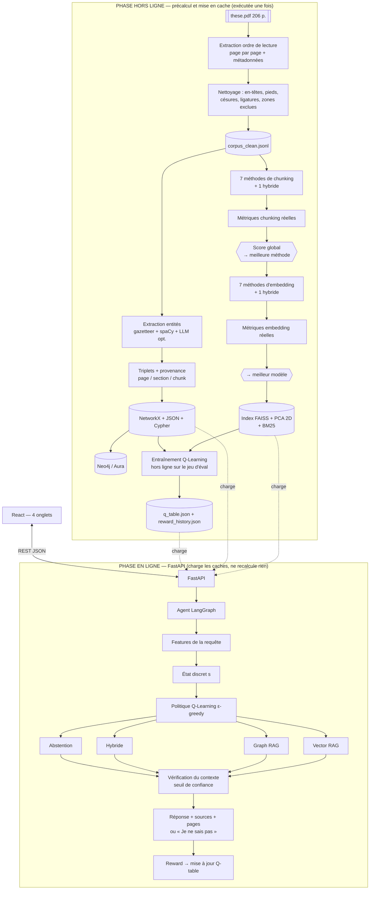

# Agentic Vectorial Graph RAG with Reinforcement Learning
## Document de compréhension consolidée et d'architecture — **avant tout codage**

Projet de fin d'année — 4ème année Spécialité Intelligence Artificielle
Corpus : *Une approche statistique pour l'étude de l'intensité et de la dynamique des vagues de froid extrêmes en Europe* — Camille Cadiou, thèse de doctorat, Université Paris-Saclay (LSCE), soutenue le 2 avril 2025, 206 pages.

---

## 1. Résumé précis de ma compréhension du projet

Il ne s'agit **pas** d'un projet de prédiction météorologique. Il s'agit d'un **système documentaire intelligent** dont l'unique source de connaissance est une thèse scientifique de 206 pages, et dont l'objectif est de démontrer trois paradigmes de RAG et leur arbitrage automatique :

1. **Vectorial RAG** — comparer *réellement* 7 méthodes de chunking et 7 méthodes d'embedding sur ce corpus, mesurer, choisir la meilleure de façon documentée, construire un Vector Store FAISS, comparer plusieurs stratégies de retrieval.
2. **Graph RAG** — transformer le contenu scientifique en graphe de connaissances (entités + relations + provenance page/section), le visualiser dans NetworkX **et** Neo4j/Aura, y détecter des communautés (Louvain) et en calculer les métriques structurelles.
3. **Agentic Graph-Vector RAG + RL** — un agent orchestré par LangChain/LangGraph qui **classe la requête** (sémantique / relationnelle / hybride / hors contexte), **route** vers le bon store via une politique **Q-Learning réelle** (Q-table, ε-greedy, α, γ, reward, historique, persistance), exécute, évalue, met à jour sa politique.
4. **Query** — l'espace utilisateur qui déclenche le pipeline complet et affiche routage, confiance, sources, pages, réponse finale ou « Je ne sais pas », et historique.

Le tout exposé par **FastAPI** et consommé par un **frontend React** en 4 onglets, avec des visualisations partout (courbes comparatives, PCA 2D, graphe interactif, communautés colorées, Q-table, reward monitor, decision path, Cypher exécuté, sous-graphe).

**La règle non négociable qui traverse tous les documents : aucune métrique inventée, aucune valeur codée en dur.** Les tableaux chiffrés des PDF `09_SPEC_METHODES_RETRIEVAL` (« Statistiques simulées ») sont explicitement pédagogiques ; tous les chiffres de notre système devront provenir d'un calcul exécuté sur la thèse.

### Ce que j'ai vérifié en ouvrant réellement le corpus (points structurants)

| Constat vérifié | Conséquence sur la conception |
|---|---|
| Le PDF possède une **vraie couche texte** (PDFLaTeX, polices embarquées) — **pas d'OCR nécessaire** | Risque n°1 classique écarté |
| Le manuscrit est **rédigé en anglais** ; le français n'apparaît que sur ~11 pages : *Résumé long* (p. 6-11), *Remerciements* (p. 12-13) et les 4 *Résumé* de fin de chapitre (p. 48, 84, 120, 126) | Le vrai enjeu **n'est pas** un corpus bilingue mais du **retrieval cross-lingue** : questions posées en français → passages en anglais. C'est ce qui impose un modèle multilingue comme modèle principal, et ce qui rend `all-MiniLM-L6-v2` (anglais) inadapté comme modèle principal, mais parfait comme baseline de comparaison. |
| Les chapitres 3, 4 et l'annexe B contiennent des **articles de revue insérés en double colonne** | Une extraction naïve `pdftotext -layout` **fusionne les deux colonnes sur la même ligne** et détruit les phrases. **Testé et résolu** : l'extraction en ordre de lecture (`pdftotext` sans `-layout`, ou PyMuPDF `get_text("blocks")` trié) restitue correctement les colonnes et recolle les mots coupés en fin de ligne. |
| La thèse contient une **page « Acronyms » officielle** (p. 128-129) : AA, AMOC, AMS, AR6, CAO, CMIP/CMIP5/CMIP6, DJF, ECMWF, EEA, GCM, GKTL, IPCC, NAO, NAO−, NOAA, QBO, SB (Scandinavian Blocking), SSP, SSW, SWG, TPT, WCC, WMO — **avec, pour chacun, la liste des pages où il apparaît** | C'est un **gazetteer d'entités validé par l'auteure**, avec provenance déjà fournie. Il devient le socle de l'ontologie du graphe : on n'invente pas les entités, on part de celles que la thèse déclare. |
| Décalage de pagination : **page thèse = page PDF − 15** (vérifié sur Bibliography p.115→130 et Acronyms p.113→128) | Il faut stocker et afficher **les deux numéros** pour que les citations soient vérifiables par le jury |
| Volume utile après exclusion de la bibliographie, des remerciements, de la TOC et de la liste des figures : **≈ 389 000 caractères** | ≈ **400 à 650 chunks** selon la méthode → tout le pipeline (7 chunkings + 7 embeddings) tourne en **minutes sur CPU**, sans GPU. Le projet est faisable sur un PC Windows normal. |
| L'**annexe B** (p. 150-173, ~90 000 caractères) traite de la *rain bomb australienne 2022* et des *canicules des JO de Paris 2024* — **rien à voir avec les vagues de froid** | À exclure de l'index (elle polluerait l'espace sémantique et le graphe) — et elle fournit gratuitement de vraies questions « hors contexte » pour le jeu d'évaluation |

### Cartographie du corpus (pagination PDF)

| Zone | Pages PDF | Traitement |
|---|---|---|
| Couverture HAL + page de titre | 1–5 | Exclue (métadonnées conservées) |
| **Résumé long (FR) + Abstract (EN)** | 6–11 | **Conservé — très haute valeur** |
| Remerciements | 12–13 | Exclu |
| Contents / liste des annexes | 14–15 | Exclu |
| Ch.1 Introduction (cold events, rare event algorithms) | 16–33 | Conservé |
| Ch.2 Analogues-Stochastic Weather Generator + Résumé | 34–49 | Conservé |
| Ch.3 Simulating extreme winters with a SWG (2 articles) | 50–85 | Conservé — **double colonne** |
| Ch.4 Intensity & dynamics of cold spells in CMIP6 (article) | 86–121 | Conservé — **double colonne** |
| Ch.5 Conclusions & Perspectives + Résumé | 122–127 | Conservé |
| Acronyms | 128–129 | **Ontologie / gazetteer** (non chunké comme prose) |
| Bibliography | 130–139 | Exclu du RAG (option : nœuds `Reference` du graphe) |
| List of Figures / Tables | 140–141 | Exclu |
| Annexe A — Predictability of extreme cold spells | 144–149 | Conservé |
| Annexe B — autres projets (hors sujet) | 150–173 | **Exclu** (source de questions hors contexte) |
| Annexe C — Supplement CMIP6 France | 174–206 | Conservé (majoritairement figures) |

---

## 2. Checklist exhaustive des exigences obligatoires

### A. Ingestion
- [ ] Lecture du PDF de la thèse (206 pages), extraction **page par page**
- [ ] Métadonnées conservées par chunk : `page_pdf`, `page_these`, `chapitre`, `section`, `source`, `langue`
- [ ] Nettoyage : en-têtes courants (`Chapter N. Titre`, `C. Cadiou and P. Yiou: …`), pieds de page, numéros de page, ligatures/caractères LaTeX, césures de fin de ligne
- [ ] Exclusion : remerciements, TOC, pages vides, bibliographie, listes de figures
- [ ] Conservation : résumés, définitions, méthodes, résultats, conclusions
- [ ] **Persistance du corpus nettoyé** (JSONL) pour ne pas retraiter 206 pages à chaque démarrage

### B. Chunking — 7 méthodes réellement implémentées
- [ ] Fixed-size · Sentence-based · Paragraph-based · Sliding-window · Recursive splitting · Semantic similarity · Structure/topic
- [ ] **Au moins une méthode hybride** combinant deux méthodes pertinentes
- [ ] Par méthode, calcul réel de : nb de chunks, longueur moyenne, écart-type, min, max, similarité intra, similarité inter, Precision@k, Recall@k, F1, temps d'exécution
- [ ] Graphes comparatifs + **sélection automatique** de la meilleure méthode selon un **score global documenté**

### C. Embeddings — 7 représentations
- [ ] 7 méthodes réalistes, exécutables, compatibles FR + EN
- [ ] Métriques réelles : cosine similarity, intra, inter, Precision@k, Recall@k, F1, MAP, MRR, NDCG, temps d'encodage
- [ ] Sélection de la meilleure sur résultats réels
- [ ] **Modèle multilingue léger** comme modèle principal du prototype
- [ ] Au moins une approche **hybride d'embedding**

### D. Vector Store & Retrieval
- [ ] Index FAISS construit, **sauvegardé et rechargeable**
- [ ] **PCA 2D** des embeddings, clusters sémantiques colorés, points les plus proches d'une requête
- [ ] Comparaison : cosinus · top-k semantic · FAISS ANN · BM25 · hybride BM25+embeddings · re-ranking (si réalisable)
- [ ] Affichage des chunks récupérés avec **page, score, extrait**
- [ ] Synthèse basée **uniquement** sur le contexte récupéré
- [ ] **« Je ne sais pas »** quand le contexte est insuffisant

### E. Graph Store
- [ ] Extraction d'entités scientifiques pertinentes · relations **fiables** (issues du texte, non inventées)
- [ ] Triplets sujet-relation-objet avec **provenance** (page, section, chunk)
- [ ] Graphe NetworkX · export JSON entités/relations · génération Cypher · insertion Neo4j / Aura

### F. Communautés & métriques du graphe
- [ ] Graphe NetworkX + graphe Neo4j/Aura
- [ ] Communautés **Louvain** colorées, nombre, membres, **modularité**
- [ ] Densité, degree/betweenness/closeness centrality, nœuds les plus importants
- [ ] Sous-graphe correspondant à une requête, légende des types de nœuds et relations
- [ ] **Visualisation dans l'interface** (pas seulement des `print` terminal)

### G. Agentic RAG + RL
- [ ] LangChain (connexion) · LangGraph (orchestration) · Q-Learning · Neo4j · FAISS
- [ ] Classification + routage de **4 types** : Semantic → Vector · Relational → Graph · Hybrid → les deux · Out of context → « Je ne sais pas »
- [ ] Q-Learning **réel** : états, actions, Q-table, ε-greedy, reward, α, γ, mise à jour, historique des rewards, **sauvegarde de la Q-table**
- [ ] **Interdiction** de remplacer le Q-Learning par un if/else déguisé

### H. Interface
- [ ] Backend FastAPI · Frontend React · API REST
- [ ] 4 onglets : Vectorial RAG · Graph RAG · Agentic Graph RAG · Query
- [ ] Affichages : 7 chunkings, tableaux de métriques, graphes comparatifs, méthode sélectionnée, PCA 2D, résultats de retrieval, graphe interactif, communautés, métriques du graphe, Q-table, politique état→action, reward monitor, decision path, Cypher exécutée, sous-graphe, route choisie, score de confiance, sources et pages, réponse finale, historique des requêtes

### Contraintes transverses
- [ ] Fonctionne sur PC **Windows** normal · modèles HF **gratuits et légers** · **aucune API payante**
- [ ] **Aucune clé secrète dans le code** → `.env` pour Neo4j et services externes
- [ ] Fonctionnement **local** de démonstration · **seed fixe** · **cache** des traitements longs
- [ ] Sauvegarde des métriques, graphes, chunks, embeddings, triplets
- [ ] Chaque métrique affichée = vrai calcul · gestion d'erreurs claire · code commenté
- [ ] Aucune donnée fictive non explicitement identifiée comme telle

### Jeu d'évaluation
- [ ] Questions **sémantiques / relationnelles / hybrides / hors contexte**, avec réponse attendue, pages ou sections pertinentes, chunks pertinents
- [ ] Permet de calculer réellement Precision@k, Recall@k, F1, MAP, MRR, NDCG

---

## 3. Contradictions et ambiguïtés trouvées dans les PDF

| # | Contradiction / ambiguïté | Sources en conflit |
|---|---|---|
| **A1** | **Nombre de méthodes de retrieval** : « meilleure méthode parmi les **5 vues en TP** » vs tableau de **6 méthodes** (similarité brute, ANN, BM25/TF-IDF, DPR, hybride, re-ranking) vs ta liste de 6 (cosinus, top-k, FAISS ANN, BM25, hybride, re-ranking) | `03` p.2 vs `09` p.1 vs ton brief |
| **A2** | **DPR** est listé comme méthode de retrieval alors que le même tableau indique « nécessite entraînement » — incompatible avec « prototype léger, sans API payante, réalisable rapidement » | `09` (interne) vs contraintes techniques |
| **A3** | **Nombre d'actions du Q-Learning** : 3 actions (`use_graph`, `use_vector`, `fallback`) et 2 états (`graph`, `vector`) dans le code de référence, contre **4 types de requêtes** (semantic, relational, hybrid, out of context) exigés fonctionnellement | `07` p.7-12 et `02` figure 2 vs `02` §4 + `03` p.5 + ton brief |
| **A4** | **Formule de mise à jour Q** : la figure officielle donne `Q(S,A) ← Q(S,A) + α[R − Q(S,A)]` — c'est un **bandit manchot sans γ** — alors que le facteur de discount **γ est exigé** | `02` figure 2 vs `07` §7 (`gamma=0.9` défini mais jamais utilisé) vs ton brief §G |
| **A5** | **Terminologie du 3ème type** : l'interface parle de `Systematic`, le TP et ton brief parlent de `Relational` | `03` p.4-5 vs `02` §4 |
| **A6** | **LLM d'extraction** : « LLM de Google (via Hugging Face) » vs `dslim/bert-base-NER` (modèle NER anglais, pas un LLM) vs `spaCy fr_core_news_sm` (modèle français) — trois choix différents pour la même tâche, sur un corpus **anglais** | `02` §2 vs `07` §4 vs `08` §4 |
| **A7** | **Fiabilité des relations** : le code de référence génère des relations par simple co-occurrence étiquetées `related_to`, et des relations en dur via `if "Entreprise X" in chunk` — ton brief exige des relations « tirées du contenu de la thèse et non inventées arbitrairement » | `08` §4 et `07` §5 vs ton brief §E |
| **A8** | **Métriques simulées** : `09` fournit des tableaux de précision/rappel/temps explicitement « simulés » et codés en dur, ce que ton brief interdit formellement | `09` §III vs ton brief |
| **A9** | **NetworkX vs Neo4j** : les deux sont exigés comme cible d'affichage, sans dire lequel fait autorité, ni ce qu'il advient si Aura est indisponible pendant la démo | `02` §2 vs `03` p.3 |
| **A10** | **Frontend** : « HTML ou React, au choix » vs React imposé | `03` p.6-7 vs ton brief §H |
| **A11** | **Endpoints** : 4 endpoints canoniques (`POST /query`, `GET /vectorial`, `GET /graph`, `GET /agentic`) — insuffisants pour alimenter les ~20 affichages exigés ; l'infographie `03` p.9 duplique même `/agentic` deux fois | `03` p.6 et p.9 vs `03` liste des affichages |
| **A12** | **7ème méthode de chunking** : « Topic **ou** document-structure chunking » — deux techniques très différentes (LDA/BERTopic vs découpage par chapitres) | `02`/ton brief |
| **A13** | **Precision@k / Recall@k pour le chunking** : ces métriques supposent une vérité terrain, mais les chunks **changent à chaque méthode** — comparer des Precision@k calculés sur des chunks différents n'a de sens que si la granularité de la vérité terrain est fixée | `04` (tableau des métriques) — non spécifié |
| **A14** | **« Similarité intra / inter »** n'est jamais définie mathématiquement (intra = entre phrases d'un même chunk ? inter = entre centroïdes ? entre voisins ?) | `04` |
| **A15** | **Reproductibilité vs exploration** : seed fixe exigée, mais ε-greedy est stochastique et la Q-table évolue à chaque requête → deux démos donnent des résultats différents | ton brief (contraintes) vs §G |
| **A16** | **Corpus des exemples** : Alice/Bob/marketing/CNN/Jean Dupont — explicitement à remplacer, mais `08` construit tout son pipeline autour d'un corpus « IA » avec `spaCy` français | `07`, `08` vs ton brief |
| **A17** | **Génération de la réponse finale** : les documents exigent une « synthèse » et un « résumé récupéré », sans préciser si un LLM génératif local est obligatoire ou si une synthèse extractive suffit | `03` p.2, `02` figure 2 — non tranché |

---

## 4. Décision proposée pour chaque ambiguïté

| # | Décision | Justification |
|---|---|---|
| **A1** | Implémenter **6 méthodes** : cosinus exhaustif, top-k FAISS exact (`IndexFlatIP`), FAISS ANN (`IndexIVFFlat`), BM25, hybride BM25+dense (fusion RRF), re-ranking cross-encoder. Le re-ranking est **activable/désactivable** par un flag. | Couvre les 5 « vues en TP » **et** les 6 du tableau : sur-ensemble, aucun risque de manque. L'ordre de priorité place `03` avant `09`, donc les 5 du TP sont garanties. |
| **A2** | **DPR remplacé** par « top-k semantic search avec bi-encodeur pré-entraîné », et je le documente explicitement comme tel dans le rapport (DPR *est* un bi-encodeur ; seul l'entraînement est écarté). | Respecte l'esprit du tableau sans violer la contrainte « léger, rapide, gratuit ». |
| **A3** | **4 actions** : `use_vector`, `use_graph`, `use_hybrid`, `abstain`. **16 états** (voir §10). | L'exigence fonctionnelle (4 types) prime sur le code d'exemple, qui est pédagogique. Avec 3 actions, « hybride » serait impossible à router. |
| **A4** | Implémenter la **vraie règle de Q-Learning** `Q(s,a) ← Q(s,a) + α[r + γ·max_a' Q(s',a') − Q(s,a)]`, avec un **épisode à 2 étapes** (routage → décision post-récupération), ce qui donne un rôle réel à γ. La formule de la figure reste le cas particulier de l'état terminal. | Satisfait la figure du prof **et** l'exigence explicite d'un γ. Un γ défini mais inutilisé serait le défaut n°1 relevé en soutenance. |
| **A5** | Étiquette interne `relational`, **affichage bilingue** dans l'UI : « Relationnel (Systematic) ». | Zéro perte pour le correcteur, cohérence du code. |
| **A6** | Pipeline d'extraction **en cascade** : (1) gazetteer issu de la page *Acronyms* + ontologie du domaine ; (2) spaCy `en_core_web_sm` (corpus anglais) + `fr_core_news_sm` pour les pages FR ; (3) motifs syntaxiques/regex pour les relations typées ; (4) **passe LLM optionnelle et mise en cache** (`google/flan-t5-base` ou `Qwen2.5-0.5B-Instruct`) sur les chunks à forte densité d'entités. | Le « LLM de Google via HF » est satisfait par flan-t5/Gemma tout en restant CPU-compatible. La cascade garantit un graphe non vide **même si** la passe LLM est coupée le jour de la démo. |
| **A7** | **Aucune relation en dur.** Trois niveaux de fiabilité, tous portant un `confidence` et une provenance : `PATTERN` (motif linguistique explicite), `LLM` (triplet extrait puis validé — sujet et objet doivent exister dans le gazetteer), `CO_OCCURRENCE` (relation faible pondérée par PMI, **typée `CO_OCCURS_WITH`, jamais présentée comme causale**). Un filtre de confiance minimale est appliqué avant insertion. | Respecte « relations fiables, non inventées ». La distinction de niveau de confiance est un point fort en soutenance. |
| **A8** | **Zéro valeur codée en dur.** Toute métrique affichée provient d'une exécution horodatée, sérialisée en JSON avec la version du code. Un champ `computed_at` accompagne chaque tableau dans l'UI. | Exigence formelle du brief. |
| **A9** | **NetworkX = source de vérité**, Neo4j = miroir persistant + requêtes Cypher. Si Neo4j est indisponible : bandeau d'avertissement, l'app continue en mode dégradé, et la requête Cypher **est affichée telle qu'elle serait exécutée**. | Neo4j Aura met les instances gratuites en pause après inactivité — c'est le risque de démo le plus banal et le plus fatal. |
| **A10** | **React** (Vite). Une page HTML statique de secours n'est envisagée que si Node.js manque sur la machine de démo. | Ton brief impose React ; `03` autorise le repli. |
| **A11** | Conserver les **4 endpoints canoniques** exactement tels que nommés par le prof, et ajouter des **sous-routes** (`/vectorial/chunking`, `/graph/communities`, …). | Le correcteur retrouve ses 4 routes ; l'UI est correctement alimentée. |
| **A12** | **Document-structure chunking** (chapitre → section → sous-section, détecté par regex sur les titres + frontières de pages), et non topic modeling. | La thèse a une structure LaTeX nette et exploitable ; BERTopic/LDA sur 500 chunks serait instable et coûteux, pour un gain nul. |
| **A13** | **Vérité terrain définie à la granularité de la page, pas du chunk.** Un chunk récupéré est *pertinent* si sa page source appartient à l'ensemble des pages de référence de la question. | C'est la seule définition qui rende les 7 méthodes **comparables entre elles**. Sinon on compare des Precision@k non commensurables. Décision méthodologique à défendre explicitement dans le rapport. |
| **A14** | **Intra-similarité** = moyenne des cosinus entre les phrases d'un même chunk, moyennée sur les chunks (mesure la cohérence). **Inter-similarité** = moyenne des cosinus entre centroïdes de chunks distincts (mesure la redondance ; on veut qu'elle soit basse). Les deux formules sont écrites dans le rapport et dans les docstrings. | Comble un vide de spécification de manière standard et vérifiable. |
| **A15** | Toutes les seeds fixées (`random`, `numpy`, `torch`, PCA, Louvain). La Q-table est **entraînée hors ligne** sur le jeu d'évaluation puis **sauvegardée** ; en démo l'agent est en mode **greedy (ε=0)** par défaut, avec un bouton « mode exploration » et un bouton « réinitialiser la Q-table ». | Démo déterministe et reproductible, tout en gardant un ε-greedy réel et démontrable à la demande. |
| **A16** | Tous les exemples (Alice, Bob, Jean Dupont, CNN, marketing) sont remplacés par le domaine réel : SWG, NAO, blocage scandinave, CMIP6, vortex polaire, hiver 1963, etc. spaCy est utilisé en **anglais** sur les pages anglaises. | Le corpus est à 90 % anglais : utiliser `fr_core_news_sm` partout produirait un graphe vide ou faux. |
| **A17** | **Synthèse extractive par défaut** (sélection + assemblage des passages avec citation des pages), **génération LLM locale optionnelle** derrière un flag (`flan-t5-base` / `Qwen2.5-0.5B`). Dans les deux cas, la réponse est **strictement contrainte au contexte récupéré**, et « Je ne sais pas » dès que le score de contexte passe sous le seuil. | Zéro risque d'hallucination, zéro dépendance à une API payante, temps de réponse < 1 s. C'est **la question la plus impactante pour ton planning** : voir §16. |

---

## 5. Architecture technique complète



**Principe directeur : rien de lourd ne s'exécute pendant la démo.** Toute la chaîne coûteuse (parsing, chunking ×7, embeddings ×7, graphe, entraînement RL) tourne **une fois** via `scripts/build_all.py` et produit des artefacts sur disque. FastAPI démarre en quelques secondes en chargeant ces artefacts. C'est la seule architecture qui garantit une démo fluide.

**Couches :**
1. **Ingestion** — PDF → pages nettoyées + métadonnées (persistant)
2. **Chunking** — 7+1 stratégies, métriques, sélection automatique
3. **Embeddings** — 7+1 représentations, métriques, sélection automatique
4. **Vector Store** — FAISS (exact + ANN), BM25, PCA 2D, cache
5. **Graph Store** — ontologie → triplets → NetworkX → JSON/Cypher → Neo4j
6. **Analyse de graphe** — Louvain, modularité, densité, centralités, sous-graphes
7. **Agent** — LangChain (composants) + LangGraph (workflow) + Q-Learning (politique)
8. **Évaluation** — jeu d'éval → Precision@k, Recall@k, F1, MAP, MRR, NDCG
9. **API** — FastAPI, schémas Pydantic, CORS, gestion d'erreurs
10. **UI** — React 4 onglets, Recharts, graphe interactif

---

## 6. Flux complet des données, du PDF à la réponse finale

**Chaîne hors ligne**
1. `these.pdf` → extraction **en ordre de lecture** page par page (gère les doubles colonnes) → `{page_pdf, page_these, raw_text}`
2. Nettoyage : suppression des en-têtes courants, des numéros de page isolés, recollage des mots coupés (`con-\nsidered` → `considered`), normalisation Unicode (ligatures `fi`, `−`, guillemets)
3. Annotation structurelle : rattachement de chaque page à son chapitre/section via la TOC et les titres détectés ; marquage `keep=False` pour biblio, remerciements, TOC, liste des figures, annexe B ; détection de langue par page
4. → `data/processed/corpus_clean.jsonl` (**cache : plus jamais de re-parsing**)
5. Chunking ×7 (+ hybride) → `chunks_<method>.jsonl`, chaque chunk portant `chunk_id, text, page_pdf, page_these, chapitre, section, langue, method`
6. Métriques de chunking (avec un modèle d'embedding **de référence fixe**, pour que la comparaison soit équitable) → `metrics_chunking.json` → **méthode gagnante**
7. Embeddings ×7 (+ hybride) sur les chunks de la méthode gagnante → métriques → `metrics_embeddings.json` → **modèle gagnant**
8. Index FAISS (`IndexFlatIP` sur vecteurs L2-normalisés + `IndexIVFFlat`), index BM25, projection PCA 2D + clustering KMeans → `faiss.index`, `pca_2d.json`
9. Extraction d'entités (gazetteer *Acronyms* + ontologie + spaCy + LLM optionnel) → normalisation/résolution des alias (`NAO` ≡ `North Atlantic Oscillation`) → triplets avec provenance → `entities.json`, `relations.json`, `cypher.cql`
10. Graphe NetworkX → Louvain, modularité, densité, centralités → `graph_metrics.json` ; insertion Neo4j (MERGE idempotent)
11. Jeu d'évaluation (~40 questions annotées) → entraînement Q-Learning hors ligne (ε décroissant, plusieurs époques) → `q_table.json`, `reward_history.json`

**Chaîne en ligne (une requête utilisateur)**
1. `POST /query {question}` → React envoie la question
2. **Features** : longueur, présence d'entités du gazetteer, marqueurs relationnels (`lien`, `relation`, `entre`, `influence`, `qui`), marqueurs conceptuels (`qu'est-ce que`, `explique`, `définition`), couverture lexicale du vocabulaire du corpus
3. **État discret `s`** (16 états possibles) — *cette étape reste une extraction de features, elle ne décide pas*
4. **Politique Q-Learning** : `a = argmax Q[s]` (ε-greedy si mode exploration) → `use_vector` / `use_graph` / `use_hybrid` / `abstain`
5. **Exécution** : Vector → FAISS top-k + extraits + pages + scores ; Graph → matching d'entités → Cypher → sous-graphe + chemins ; Hybride → les deux, fusion RRF
6. **Vérification du contexte** : score de similarité max, nombre d'entités trouvées, couverture → si sous le seuil → **« Je ne sais pas »**
7. **Décision post-récupération** (2ème pas de l'épisode RL) : répondre / s'abstenir / escalader vers hybride
8. **Synthèse** contrainte au contexte + citation des pages (thèse et PDF)
9. **Reward** calculé (voir §10) → mise à jour de la Q-table → historique
10. **Réponse JSON** : route, confiance, decision path, chunks + pages + scores, Cypher exécutée, sous-graphe, réponse finale, Q-table mise à jour → affichage React

---

## 7. Arborescence proposée du projet

```
pfa-agentic-graph-rag/
├── README.md
├── .gitignore                      # exclut .env, data/, models/, *.index
├── backend/
│   ├── requirements.txt            # versions ÉPINGLÉES
│   ├── .env.example                # NEO4J_URI, NEO4J_USER, NEO4J_PASSWORD (jamais .env)
│   ├── app/
│   │   ├── main.py                 # FastAPI, CORS, routers, startup
│   │   ├── config.py               # chemins, seeds, seuils, flags (dotenv)
│   │   ├── api/
│   │   │   ├── routes_vectorial.py
│   │   │   ├── routes_graph.py
│   │   │   ├── routes_agentic.py
│   │   │   ├── routes_query.py
│   │   │   └── routes_eval.py
│   │   ├── core/
│   │   │   ├── ingestion/          # pdf_reader.py, cleaner.py, structure.py
│   │   │   ├── chunking/           # methods.py (7+hybride), metrics.py, selector.py
│   │   │   ├── embeddings/         # models.py (7+hybride), metrics.py, selector.py
│   │   │   ├── vectorstore/        # faiss_store.py, bm25_store.py, pca.py
│   │   │   ├── retrieval/          # methods.py (6), fusion.py, reranker.py
│   │   │   ├── graph/              # ontology.py, extractor.py, triples.py,
│   │   │   │                       # networkx_store.py, neo4j_store.py,
│   │   │   │                       # cypher.py, communities.py, metrics.py
│   │   │   ├── agent/              # features.py, state.py, qlearning.py,
│   │   │   │                       # policy.py, langgraph_flow.py, reward.py
│   │   │   ├── generation/         # extractive.py, llm_local.py (optionnel)
│   │   │   └── evaluation/         # ir_metrics.py, runner.py
│   │   ├── schemas/                # modèles Pydantic (requêtes/réponses)
│   │   └── utils/                  # cache.py, seeds.py, timing.py, logging.py
│   ├── scripts/
│   │   ├── build_all.py            # pipeline hors ligne complet
│   │   ├── build_graph.py
│   │   ├── train_qlearning.py
│   │   └── push_to_neo4j.py
│   ├── eval/
│   │   └── eval_set.json           # ~40 questions annotées
│   └── data/
│       ├── raw/these.pdf
│       ├── processed/              # corpus_clean.jsonl, chunks_*.jsonl
│       ├── artifacts/              # faiss.index, embeddings.npy, pca_2d.json,
│       │                           # entities.json, relations.json, cypher.cql,
│       │                           # q_table.json, reward_history.json
│       └── metrics/                # metrics_chunking.json, metrics_embeddings.json,
│                                   # metrics_retrieval.json, graph_metrics.json
└── frontend/
    ├── package.json
    ├── vite.config.js
    └── src/
        ├── App.jsx                 # navigation 4 onglets
        ├── api/client.js           # axios, baseURL configurable
        ├── pages/
        │   ├── QueryPage.jsx
        │   ├── VectorialPage.jsx
        │   ├── GraphPage.jsx
        │   └── AgenticPage.jsx
        └── components/             # voir §12
```

---

## 8. Bibliothèques prévues et rôle de chacune

| Bibliothèque | Rôle exact dans le projet |
|---|---|
| `pymupdf` (ou `pdftotext`/poppler) | Extraction du texte **en ordre de lecture** (indispensable pour les pages en double colonne) + numéros de page |
| `pdfplumber` | Vérification ponctuelle de la mise en page (détection des colonnes) |
| `regex` / `unicodedata` | Nettoyage : en-têtes, césures, ligatures, normalisation |
| `langdetect` (ou heuristique lexicale) | Étiquetage FR/EN par page |
| `nltk` / `pysbd` | Segmentation en phrases (chunking par phrases, similarité intra) |
| `langchain-text-splitters` | `RecursiveCharacterTextSplitter` (méthode 5) — l'implémentation de référence |
| `sentence-transformers` | Modèles d'embedding 4 à 7 + cross-encoder de re-ranking |
| `scikit-learn` | TF-IDF, TruncatedSVD (LSA), PCA 2D, KMeans, métriques, `cosine_similarity` |
| `gensim` | FastText/Word2Vec entraîné sur le corpus (méthode 3) |
| `faiss-cpu` | Vector Store : `IndexFlatIP` (exact) et `IndexIVFFlat` (ANN) |
| `rank_bm25` | Retrieval lexical BM25 |
| `numpy` / `pandas` | Calculs vectoriels, tableaux de métriques, sérialisation |
| `spacy` + `en_core_web_sm` + `fr_core_news_sm` | NER pour ORG/LOC/DATE, analyse syntaxique pour les motifs de relations |
| `networkx` | Graphe de connaissances, Louvain (`community.louvain_communities`), modularité, densité, centralités |
| `neo4j` (driver officiel) | Insertion des nœuds/relations, exécution des requêtes Cypher, récupération des sous-graphes |
| `python-dotenv` | Chargement de `.env` (aucun secret dans le code) |
| `langchain` / `langchain-community` | Connexion des composants : retrievers, wrappers d'embeddings, `Neo4jGraph` |
| `langgraph` | Orchestration du workflow de l'agent (nœuds : features → politique → exécution → vérification → reward) |
| `transformers` + `torch` (CPU) | Passe LLM optionnelle d'extraction de triplets et génération locale optionnelle |
| `fastapi` + `uvicorn` + `pydantic` | API REST, validation, documentation `/docs` automatique |
| `matplotlib` | Figures pour le rapport (les graphes de l'UI sont rendus côté React) |
| `pytest` | Tests unitaires minimaux (métriques, Q-update, chargement des caches) |
| **Frontend** : `react`, `vite`, `axios`, `recharts`, `react-force-graph-2d` | UI, appels REST, courbes/barres/scatter PCA, graphe interactif zoomable |

---

## 9. Liste des métriques et manière **réelle** de les calculer

### 9.1 Chunking (par méthode)
| Métrique | Calcul réel |
|---|---|
| Nombre de chunks | `len(chunks)` |
| Longueur moyenne / écart-type / min / max | `numpy` sur la distribution des longueurs (en caractères **et** en tokens) |
| Similarité **intra** | Pour chaque chunk : moyenne des cosinus entre embeddings de ses phrases (chunks à 1 phrase exclus) ; puis moyenne sur les chunks |
| Similarité **inter** | Moyenne des cosinus entre centroïdes de paires de chunks distincts (échantillonnage aléatoire à seed fixe si N grand) |
| Precision@k | Sur le jeu d'éval : `#chunks pertinents dans le top-k / k`, **pertinence définie au niveau page** (décision A13), moyennée sur les questions |
| Recall@k | `#pages de référence couvertes par le top-k / #pages de référence` |
| F1 | Moyenne harmonique de P@k et R@k |
| Temps d'exécution | `time.perf_counter()` autour du découpage seul |
| **Score global** | `0.35·F1@5 + 0.20·(1−inter) + 0.20·intra + 0.15·régularité_longueurs + 0.10·rapidité_normalisée`, **toutes les composantes min-max normalisées entre méthodes ; pondérations affichées dans l'UI et modifiables** |

### 9.2 Embeddings (par méthode)
Cosine similarity (moyenne question↔chunk pertinent), intra, inter (mêmes formules), Precision@k, Recall@k, F1, **temps d'encodage** (s et chunks/s), plus :
- **MAP** = moyenne, sur les questions, de la précision moyenne aux rangs des documents pertinents
- **MRR** = moyenne de `1 / rang du premier document pertinent`
- **NDCG@k** = `DCG@k / IDCG@k` avec gains binaires (pertinent = page de référence), log₂ en dénominateur
Toutes implémentées dans `evaluation/ir_metrics.py`, testées unitairement sur un mini-exemple à résultat connu.

**Protocole de comparaison (important) :** les 7 chunkings sont comparés à **modèle d'embedding constant** ; puis les 7 embeddings sont comparés **sur le chunking gagnant**. Soit 14 encodages au lieu de 49 — équitable, défendable, et exécutable en quelques minutes.

### 9.3 Retrieval (par méthode)
Precision@k, Recall@k, F1, MAP, MRR, NDCG@k, latence moyenne par requête (ms), et pour FAISS ANN : **recall vs recherche exacte** (mesure honnête de la perte d'approximation ; à noter qu'avec ~500 chunks l'ANN n'apporte aucun gain de vitesse — ce sera dit explicitement plutôt que masqué).

### 9.4 Graphe
Nombre de nœuds/arêtes, densité (`nx.density`), nombre de communautés Louvain, **modularité** (`nx.community.modularity`), taille et membres de chaque communauté, degree/betweenness/closeness centrality (top-10 par mesure), nombre de composantes connexes, distribution des degrés, nombre de triplets par niveau de confiance (`PATTERN` / `LLM` / `CO_OCCURRENCE`).

### 9.5 Agent
Taux de routage correct par rapport au type annoté, reward cumulé et moyenne glissante par épisode, taux d'abstention correcte / incorrecte, évolution de la Q-table (heatmap), latence de bout en bout.

---

## 10. Q-Learning : états, actions, rewards

**Espace d'états — 16 états discrets** (`type × entités × couverture`) :
- `type_query` ∈ {`semantic`, `relational`, `hybrid`, `unknown`} — issu des features linguistiques
- `has_graph_entity` ∈ {0, 1} — au moins une entité du gazetteer reconnue dans la question
- `lexical_coverage` ∈ {`low`, `high`} — proportion de mots de la question présents dans le vocabulaire du corpus (seuil calibré sur le jeu d'éval)

> La détection de features **prépare** l'état ; elle ne choisit **pas** l'action. C'est bien la Q-table qui décide — c'est exactement la nuance demandée dans le brief (« une règle initiale peut aider à extraire les caractéristiques, mais la sélection finale doit être représentée par le Q-Learning »).

**Actions — 4** : `use_vector`, `use_graph`, `use_hybrid`, `abstain`

**Épisode à 2 pas** (ce qui donne un rôle réel à γ) :
- Pas 1 — état `s₀` (features) → action de routage
- Pas 2 — état `s₁` (résultat de la récupération : contexte trouvé / faible / vide) → action finale ∈ {`answer`, `abstain`, `escalate_hybrid`}

**Fonction de reward** (toutes les composantes sont mesurées, aucune n'est arbitraire) :

| Situation | Reward |
|---|---|
| Au moins une page de référence présente dans le top-k | **+1.0** |
| Aucune page de référence dans le top-k | **−1.0** |
| Bonus qualité de classement : NDCG@5 ≥ 0.7 | **+0.5** |
| Question hors contexte **et** action = `abstain` | **+1.0** |
| Abstention alors qu'une réponse existait | **−1.0** |
| Coût de calcul de `use_hybrid` | **−0.3** |
| Feedback utilisateur 👍 / 👎 (prévu par `05_SPEC`) | **±0.5** |

**Hyperparamètres** : α = 0.1, γ = 0.9, ε : 0.30 → 0.05 (décroissance exponentielle sur les épisodes d'entraînement), seed fixe.

**Mise à jour** : `Q(s,a) ← Q(s,a) + α·[r + γ·max_{a'} Q(s',a') − Q(s,a)]`

**Entraînement** : hors ligne, ~40 questions × 30 époques ≈ 1 200 transitions → la courbe de reward **converge visiblement**, ce qui rend le *Reward Monitor* de l'interface réellement démonstratif (au lieu d'un bruit aléatoire). Q-table et historique sauvegardés en JSON, rechargés au démarrage.

**Score de confiance affiché** (l'interface montre « Confiance : 89 % ») — formule explicite, jamais inventée :
`confiance = 0.5 · softmax(Q[s])[a] + 0.5 · score_de_contexte_normalisé`, la formule étant affichée en infobulle dans l'UI.

---

## 11. Endpoints FastAPI prévus

**Les 4 endpoints canoniques du prof sont conservés à l'identique**, complétés par des sous-routes.

| Méthode | Route | Rôle |
|---|---|---|
| GET | `/health` | État du système : caches chargés, Neo4j joignable, modèles disponibles |
| **POST** | **`/query`** | **Pipeline agentique complet** → route, confiance, decision path, chunks+pages+scores, Cypher, sous-graphe, réponse ou « Je ne sais pas » |
| **GET** | **`/vectorial`** | Vue agrégée de l'onglet 1 (méthode de chunking retenue, modèle retenu, résumé des métriques) |
| GET | `/vectorial/chunking` | Tableau des 7+1 méthodes, toutes les métriques, score global, méthode gagnante |
| GET | `/vectorial/chunking/preview?method=` | Aperçu hiérarchique Document → Chunks → Sub-chunks |
| GET | `/vectorial/embeddings` | Tableau des 7+1 méthodes d'embedding + toutes les métriques IR |
| GET | `/vectorial/pca?query=&k=` | Points PCA 2D, labels de cluster, indices des k plus proches de la requête |
| POST | `/vectorial/retrieve` | Comparaison des 6 méthodes de retrieval sur une requête + chunks/pages/scores/extraits |
| **GET** | **`/graph`** | Nœuds, arêtes, types, légende, statistiques globales |
| GET | `/graph/communities` | Communautés Louvain, couleurs, modularité, membres |
| GET | `/graph/metrics` | Densité, centralités (degree/betweenness/closeness), top nœuds |
| POST | `/graph/subgraph` | Sous-graphe pertinent pour une requête + **la requête Cypher réellement exécutée** |
| GET | `/graph/neo4j/status` | Disponibilité Aura (bandeau de mode dégradé côté UI) |
| **GET** | **`/agentic`** | Q-table, politique état→action, historique des rewards, hyperparamètres |
| POST | `/agentic/train` | Relance l'entraînement hors ligne (bouton de démo) |
| POST | `/agentic/feedback` | 👍/👎 → reward → mise à jour de la Q-table |
| POST | `/agentic/reset` | Réinitialise la Q-table (démo de l'apprentissage à partir de zéro) |
| GET | `/query/history` | Historique des requêtes de la session |
| GET | `/eval/run` | Exécute le jeu d'évaluation → Precision@k, Recall@k, F1, MAP, MRR, NDCG |

---

## 12. Pages et composants React prévus

**`App.jsx`** — barre d'onglets : `Query` · `Vectorial RAG` · `Graph RAG` · `Agentic Graph RAG` (ordre de la maquette `03_SPEC`).

| Page | Composants |
|---|---|
| **QueryPage** | `QueryInput` (champ + bouton Envoyer/Exécuter) · `AnalysisBadge` (type détecté : Semantic / Relational / Hybrid) · `RoutingPreview` (vers Vectoriel ou Graph) · `ConfidenceBadge` · `AnswerPanel` (réponse + sources + pages thèse/PDF) · `QueryHistory` · `ResetButton` |
| **VectorialPage** | `ChunkingPanel` (tableau des 7+1 méthodes + `BarChart` comparatif + badge « Meilleure méthode ») · `ChunkTreeView` (Document → Chunks → Sub-chunks) · `EmbeddingsPanel` (tableau + graphes MAP/MRR/NDCG/temps) · `PcaScatter` (`ScatterChart` coloré par cluster + surbrillance des voisins de la requête + curseur « Filtre proximité ») · `RetrievalPanel` (comparaison des 6 méthodes, documents pertinents avec extrait + page + score) · `RetrievedSummary` (zone « Résumé récupéré ») |
| **GraphPage** | `GraphView` (`react-force-graph-2d`, zoom, filtres, légende des types de nœuds/relations) · `CommunitiesPanel` (clusters colorés, modularité, nombre, membres) · `GraphMetricsPanel` (densité, centralités, top nœuds) · `SemanticPathsPanel` (chemins entre deux entités) · `Neo4jStatusBanner` |
| **AgenticPage** | `PolicyVisualization` (état → action, table + diagramme) · `QTableHeatmap` · `RewardMonitor` (`LineChart` de l'historique) · `DecisionPath` (Query → analyse → branche → résultat) · `CypherBox` (requête exécutée, monospace) · `SubgraphView` · `HybridFeedbackLoop` (boutons 👍/👎 → reward) · `FinalAnswerPanel` (réponse + confiance + provenance) |
| Transverses | `MetricTable` (tri, export CSV) · `LoadingState` · `ErrorBanner` · `ComputedAtTag` (horodatage de calcul, preuve que rien n'est codé en dur) |

---

## 13. Plan d'implémentation étape par étape

| Étape | Contenu | Durée estimée | MVP ? |
|---|---|---|---|
| 0 | Environnement : Anaconda **Python 3.11**, `requirements.txt` épinglé, **pré-téléchargement de tous les modèles HF**, test d'import complet | 1 h | ✅ |
| 1 | Ingestion : extraction ordre de lecture, nettoyage, structure, exclusions → `corpus_clean.jsonl` + contrôle qualité visuel sur 10 pages échantillon | 2 h | ✅ |
| 2 | **Jeu d'évaluation** : ~40 questions (12 sémantiques, 12 relationnelles, 8 hybrides, 8 hors contexte) avec pages de référence — *je propose une première version que tu valides/corriges* | 2 h | ✅ **bloquant pour toutes les métriques** |
| 3 | Chunking ×7 + hybride + métriques + score global + sélection | 3 h | ✅ |
| 4 | Embeddings ×7 + hybride + métriques IR + sélection | 3 h | ✅ |
| 5 | FAISS + BM25 + PCA 2D + les 6 méthodes de retrieval + comparaison | 2 h | ✅ (re-ranking optionnel) |
| 6 | Graphe : ontologie + extraction + triplets + provenance + NetworkX + Louvain + métriques + JSON + Cypher | 4 h | ✅ |
| 7 | Neo4j / Aura : insertion, sous-graphes, mode dégradé | 1 h 30 | ⚠️ dégradable |
| 8 | Agent : features, états, Q-Learning, LangGraph, reward, entraînement hors ligne, persistance | 3 h | ✅ |
| 9 | FastAPI : tous les endpoints, schémas, CORS, gestion d'erreurs, `/docs` | 2 h 30 | ✅ |
| 10 | React : 4 onglets, tous les composants, branchement API | 5 h | ✅ (visuels avancés dégradables) |
| 11 | Passe finale : seeds, caches, README, captures de secours, répétition de la démo | 2 h | ✅ |

**Total ≈ 31 h** pour la version complète ; **≈ 16 h** pour le MVP du §15.

---

## 14. Risques techniques pouvant empêcher une démonstration imminente

| # | Risque | Gravité | Parade |
|---|---|---|---|
| R1 | **Colonnes doubles** des articles insérés → phrases fusionnées, chunks incohérents | 🔴 élevée | **Déjà résolu et testé** : extraction en ordre de lecture (`pdftotext` sans `-layout` / PyMuPDF blocks triés) + recollage des césures |
| R2 | **Téléchargement des modèles HF (~1,5 à 2 Go)** échoue ou est lent sur la machine de démo | 🔴 élevée | Télécharger **ce soir**, fixer `HF_HOME` dans le projet, tester avec `HF_HUB_OFFLINE=1` |
| R3 | **`faiss-cpu` ne s'installe pas** : pas de wheel Windows pour les Python les plus récents | 🔴 élevée | Imposer **Python 3.11** (Anaconda) ; repli documenté : `sklearn NearestNeighbors` derrière la même interface |
| R4 | **Conflit de versions** LangChain / numpy / sentence-transformers (le TP épingle `langchain==0.1.0` + `numpy==1.26.4`, incompatibles avec les versions récentes de `sentence-transformers`) | 🔴 élevée | Environnement conda **dédié**, `requirements.txt` gelé **tôt**, et surtout : LangChain/LangGraph n'orchestrent que l'agent — le pipeline vectoriel n'en dépend pas, donc un conflit ne fait pas tomber tout le système |
| R5 | **Neo4j Aura en pause** (les instances gratuites s'endettent après inactivité) ou identifiants absents | 🟠 moyenne | Réveiller l'instance **la veille** ; NetworkX fait autorité ; mode dégradé + captures d'écran Aura de secours |
| R6 | **Le jeu d'évaluation n'est pas prêt** → toutes les métriques IR sont vides | 🔴 élevée | C'est le vrai goulot d'étranglement : à traiter en **étape 2**, avant tout le reste |
| R7 | **Temps de calcul au démarrage** de l'API | 🟠 moyenne | Tout est précalculé par `build_all.py` ; l'API ne fait que charger des fichiers |
| R8 | **Modèles spaCy** (`en_core_web_sm`, `fr_core_news_sm`) non téléchargés | 🟠 moyenne | Télécharger à l'avance ; repli sur gazetteer + regex seuls (le graphe reste non vide) |
| R9 | **Graphe pauvre ou incohérent** (le piège du `related_to` par co-occurrence) | 🟠 moyenne | Ontologie fermée + niveaux de confiance + seuil PMI ; contrôle manuel des 30 relations les plus fortes |
| R10 | **CORS / port** entre React (5173) et FastAPI (8000) | 🟢 faible | `CORSMiddleware` configuré dès l'étape 9 ; `baseURL` dans un `.env` frontend |
| R11 | **Node.js absent** de la machine de démo | 🟠 moyenne | `03_SPEC` autorise HTML/JS : page de secours mono-fichier consommant la même API |
| R12 | **Cross-encoder de re-ranking trop lent** sur CPU | 🟢 faible | Limité au top-20, derrière un flag, désactivé par défaut |
| R13 | **Q-table creuse** (16 états × 4 actions avec 40 questions) | 🟠 moyenne | Entraînement multi-époques + ε décroissant ; états volontairement peu nombreux |
| R14 | **PDF de 47 Mo** : lenteur de parsing, dépôt Git alourdi | 🟢 faible | Parsé une seule fois ; `data/raw/` dans `.gitignore` |

---

## 15. MVP obligatoire et fonctionnalités secondaires

### MVP — à ne sacrifier sous aucun prétexte (~16 h)
1. Ingestion propre du PDF + cache
2. Jeu d'évaluation (même réduit à 25 questions)
3. **7 méthodes de chunking** + métriques réelles + sélection automatique
4. **7 méthodes d'embedding** + métriques réelles + sélection automatique (dont un modèle multilingue)
5. FAISS + PCA 2D + **au moins 4 méthodes de retrieval** (cosinus, top-k, BM25, hybride)
6. Graphe NetworkX + triplets avec provenance + **Louvain + modularité** + centralités + JSON + **Cypher générée**
7. **Q-Learning réel** : 16 états, 4 actions, ε-greedy, α, γ, reward, historique, Q-table sauvegardée
8. FastAPI avec les 4 endpoints canoniques + sous-routes nécessaires
9. React 4 onglets avec tous les affichages **fonctionnels** (esthétique minimale acceptée)
10. « Je ne sais pas » opérationnel + citation des pages

### Secondaire — désactivable si le temps manque
| Fonctionnalité | Repli |
|---|---|
| Insertion Neo4j / Aura | Cypher **générée et affichée** + NetworkX + captures d'écran |
| Re-ranking cross-encoder | Retiré de la comparaison, mentionné comme perspective |
| Passe d'extraction par LLM | Gazetteer + spaCy + motifs seuls |
| Génération LLM locale | Synthèse extractive (de toute façon plus sûre) |
| FAISS ANN (IVF) | Index exact seul (aucune perte : le corpus est petit) |
| Chemins sémantiques / recommandations contextuelles | Onglet Graph limité au sous-graphe + communautés |
| FastText entraîné sur le corpus | Remplacé par une 7ème variante de sentence-transformers |
| Vue hiérarchique Sub-chunks | Liste plate de chunks |
| Export CSV des métriques, tests unitaires étendus | Reportés après la démo |

---

## 16. Informations véritablement bloquantes qui me manquent

1. **Neo4j / Aura** — as-tu déjà une instance et des identifiants ? Aura Free, Neo4j Desktop local, ou rien du tout ? (Détermine si je code le mode dégradé en priorité.)
2. **Échéance réelle** — ton brief évoque une démonstration « demain ». Si c'est exact, je passe directement au **MVP du §15** et j'abandonne d'emblée les éléments secondaires.
3. **Environnement** — version de Python (**3.11 requis** pour `faiss-cpu` sur Windows), Anaconda installé ? RAM disponible ? La machine de démo a-t-elle **Internet** (≈ 2 Go de modèles à télécharger la première fois) ?
4. **Node.js** est-il installé ? Sinon je prépare le repli HTML autorisé par `03_SPEC`.
5. **Génération de la réponse finale** — synthèse **extractive** (rapide, zéro hallucination) ou LLM local **obligatoire** pour le rendu ? *C'est la décision qui pèse le plus lourd sur le planning.*
6. **Langue des questions** — le jury interrogera-t-il en français ? Le corpus étant à 90 % en anglais, cela conditionne tout le choix des embeddings (retrieval cross-lingue).
7. **Annexe B** (rain bomb australienne, canicules JO 2024) — je confirme mon intention de **l'exclure de l'index** et de m'en servir comme source de questions « hors contexte ». Es-tu d'accord ?
8. **Jeu d'évaluation** — je te propose une première version de ~40 questions annotées que tu corriges, ou préfères-tu la rédiger toi-même ? (C'est le chemin critique.)
9. **Maquette** — le prof exige-t-il la disposition et les couleurs exactes du PDF `03`, ou seulement les fonctionnalités ? (Ton brief dit « sans copier obligatoirement son design exact » — je confirme cette lecture.)
10. **Livrable attendu** — code seul, ou code + rapport écrit ? (Si rapport, je structure les sorties pour être directement citables : figures, tableaux, formules.)
